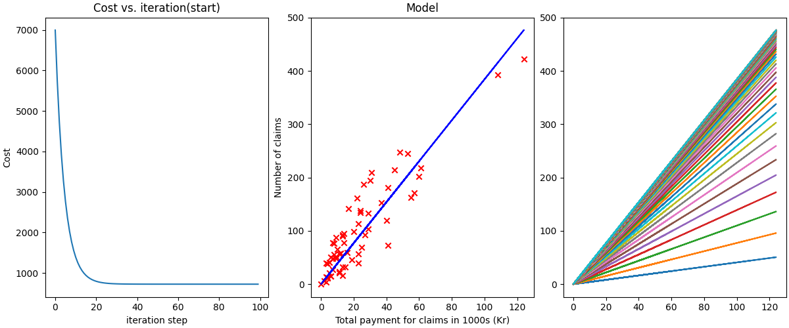
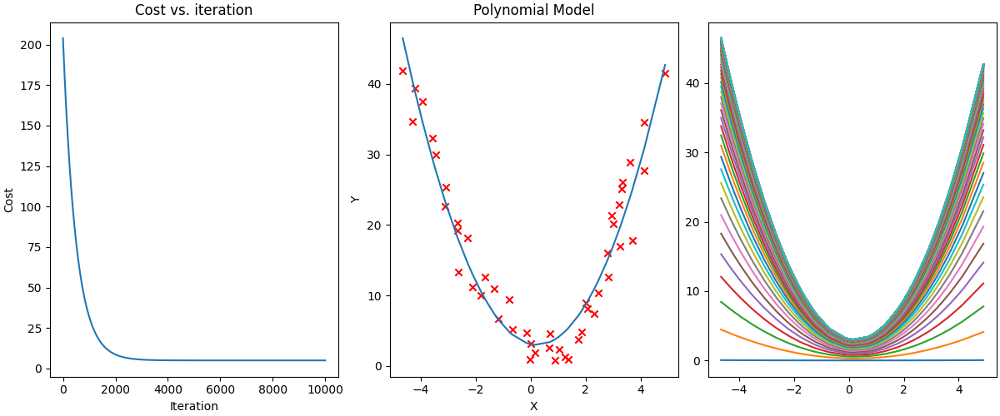

# ML Regression Models

## Simple Linear Regression

- The Simple Linear Regression (SLR) model is used to model the relationship between a single independent variable $x$ and a dependent variable $y$ by fitting a linear equation to the observed data.

- A ***training*** set of data is used and from that the learning algorithm will produce a function $f$. This function can then be used to predict an output $\hat{y}$ for values of $x$ which are not a part of the training set.

### The linear function $f$

$$ f_{w, b} = w*x + b $$

### The cost function $J$

The cost function measures the ***error*** between the predicted values $\hat{y}$ and the actual values of $y$. The goal of Linear Regression is to minimise the cost function.

$$ J_{w, b} = \frac{1}{2m} \sum_{i=1}^{m}(\hat{y} - y)^2  $$

*Where* $m$ *is the number of training examples*

### Gradient Descent

Now that we have the cost function, we find the values of $w, b$ such that our cost is minimised. Here we use the Gradient Descent Algorithm:

**Repeat until convergence:**

$$
\begin{aligned}
w &:= w - \alpha \frac{d}{dw} J(w, b) \\
b &:= b - \alpha \frac{d}{db} J(w, b)
\end{aligned}
$$

where...

$$
\begin{aligned}
\frac{d}{dw} J(w, b) &= \frac{1}{m} \sum_{i=1}^m (f_{w, b}(x^{(i)}) - y^{(i)})x^{(i)} \\
\frac{d}{dw} J(w, b) &= \frac{1}{m} \sum_{i=1}^m (f_{w, b}(x^{(i)}) - y^{(i)})
\end{aligned}
$$

*Where* $\alpha$ *is the learning rate (controls how much parameters* $w,b$ *are adjusted with each step*

*Note:* $w$ *and* $b$ *must be updated simultaneously*

After applying the Gradient Descent algorithm we now have new values for the parameters $w$ and $b$. We can now plot a line of best fit using these parameters and predict our own outputs for new inputs.

### Swedish Auto Insurance Data Set

This dataset contains the following data:
- x = number of claims
- y = total payment for all the claims in thousands of Swedish Kronor

Running `swedish_auto_insurance.py` gives us the following plots:

***Left** - Cost/Error decreases with further iterations*

***Middle** - Data plot with model-calculated line of best fit*

***Right** - line of best fit changing with iterations*

## Polynomial Regression

Sometimes the relationship between $x$ and $y$ is non-linear. The Simple Linear Regression Model will fit the data poorly.

Instead our function $f$ will be as follows:

$$ f_{w,b}(\vec{x}) = w_1 * x + w_2 * x^2 +...+ w_n * x^n + b $$

Which can written more simply as:

$$ f_{\vec{w},b}(X) = \vec{w}\cdot X + b $$

Where:

- $\vec{w}$ is a vector containing weights $[w_1,...,w_n]$
- $X$ is a Matrix defined as:

$$
X =
\begin{bmatrix}
x_1 & x_1^2 & \cdots & x_1^n \\
x_2 & x_2^2 & \cdots & x_2^n \\
\vdots & \vdots & \ddots \\ & \vdots \\
x_m & x_m^2 & \cdots & x_m^n \\
\end{bmatrix}\\,
$$

This time when applying gradient descent we must calculate the cost and gradient of each term ($w_n$) in the polynomial. However, the general formula stays the same.

